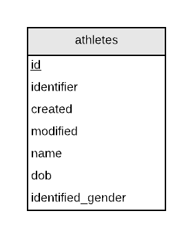
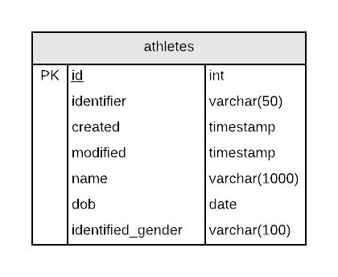

# Leader Board

## Outline

| Outline | Value |
| --- | --- |
| Course | CSI 2532 |
| Date | Winter 2021 |
| Professor | Andrew Forward, aforward@uottawa.ca |
| TA | Kalonji Kalala, hkalo081@uottawa.ca |
| TA | Lintian Wang, lwang263@uottawa.ca |
| Team | Mohamed Konate |

## Deliverables

### Deliverable 1 (5%) Hello World

| Mark | Description | Comment |
| --- | --- | --- |
| 2.0 | GitHub repository setup | [GitHub Repo](https://github.com/professor-forward/leaderboard) |
| 2.5 | ER model  | See below |
| 2.5 | Relational model / SQL schema | Both image and SQL below |
| 1.0 | SQL examples to INSERT, UPDATE, SELECT and DELETE data | See examples below |
| 1.0 | README.md contains all required information | See _this_ page |
| 1.0 | Git usage (commit messages, all students involved) | See [commit details in GitHub](https://github.com/professor-forward/leaderboard/commits/main) |
| / 10 | |

## Application Description

The leaderboard database models an athlete, including
details such as their name, date of birth, and identified gender.

## ER Model

The ER diagram was created with [Lucidchart](/lucidchart.md).



## Relational Model

The Relational Model (diagram) was also created with [Lucidchart](/lucidchart.md).



## SQL Schema

This was tested using [Online SQL Interpreter](https://www.db-book.com/db7/university-lab-dir/sqljs.html)
available with the [textbook](https://www.db-book.com/db7/index.html).

```sql
CREATE TABLE athletes (
  id int,
  identifier varchar(50),
  created timestamp,
  modified timestamp,
  name varchar(50),
  dob date,
  gender varchar(6),
  PRIMARY KEY (id)
);
CREATE TABLE schema_migrations (
migration varchar(255),
migrated_at time,
PRIMARY KEY (migration)
);
```

## Example SQL Queries

After running the above schema, you can test the queries below in the [Online SQL Interpreter](https://www.db-book.com/db7/university-lab-dir/sqljs.html)
Refresh the browser if you want to start over.

```sql
INSERT INTO athletes (id, name, gender, dob)
VALUES
(1, 'Andrew', 'm', '1986-12-01'),
(2, 'Ayana', 'F', '1998-06-11'),
(3, 'Hayden', 'm', '1996-07-24'),
(4, 'August', 'm', '1999-09-09');

INSERT INTO schema_migrations (migration, migrated_at) VALUES
('20200228145526-create-athletes.sql', '2020-02-28 14:55:26');
INSERT INTO schema_migrations (migration, migrated_at) VALUES
('20200228145900-create-migrations.sql', '2020-02-28 14:59:00');
```

Let's find all 'F' athletes.

```sql
SELECT *
FROM athletes
WHERE gender = 'F';
```

Let's update all 'm's to 'M's.

```sql
UPDATE athletes
SET gender = 'M'
WHERE gender = 'm';
```

And now all 'M' athletes.

```sql
SELECT *
FROM athletes
WHERE gender = 'M';
```

Let's delete all athletes.

```sql
DELETE FROM athletes;
```

And now the table is empty.

```sql
SELECT count(*)
FROM athletes;
```